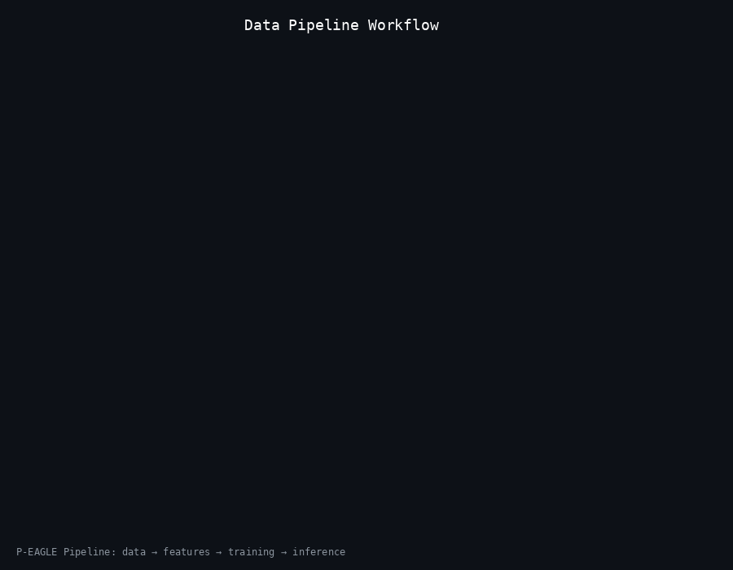

# P-EAGLE

**Parallel Speculative Decoding Framework for LLM Inference**

[](https://python.org)
[](https://pytorch.org)
[](https://developer.nvidia.com/cuda-toolkit)
[](https://arxiv.org/abs/2205.14135)
[](https://pytorch.org/docs/stable/generated/torch.nn.parallel.DistributedDataParallel.html)
[](https://arxiv.org/abs/2106.09685)
[](LICENSE)

**P-EAGLE** (Parallel EAGLE) achieves 1.5-3x inference speedup by predicting multiple future tokens in parallel using speculative decoding with EAGLE-3 architecture.

## What is P-EAGLE?

P-EAGLE implements the EAGLE-3 speculative decoding algorithm that accelerates large language model inference without quality loss. Unlike traditional autoregressive decoding (token-by-token), P-EAGLE uses a lightweight "drafter" model to predict K tokens in parallel, then verifies them all in a single pass through the target model using tree attention.

**Key Innovations:**
- **EAGLE-3 Hidden State Injection**: Combines target model embeddings with hidden states for accurate draft prediction
- **Multi-Token Prediction**: K parallel heads predict multiple future tokens simultaneously
- **Tree Attention**: Verifies K tokens in O(1) complexity per token
- **Flash Attention**: Memory-efficient attention for long contexts
- **Multi-GPU Training**: Distributed training across multiple GPUs

---

## Architecture


**How Speculative Decoding Works:**

| Step | Component | Description |
|------|-----------|-------------|
| 1 | Target Model | Provides hidden states from forward pass |
| 2 | Feature Extractor | Extracts and fuses hidden states from last N layers |
| 3 | EAGLE-3 Injection | Concatenates `[embeddings ⊕ hidden]` for drafter input |
| 4 | Drafter Model | Generates K tokens in parallel with MTP heads |
| 5 | Tree Attention | Verifies all K tokens in one target model pass |
| 6 | Accept/Reject | Accepted tokens used, rejected tokens resampled |

---

## Data Pipeline



```
Raw Data → Process → Extract Features → Train Drafter → Inference/Evaluate
```

---

## Quick Start

```bash
# Install dependencies
pip install -r requirements.txt

# Run full pipeline
./run_full_pipeline.sh

# Or step by step
python scripts/generate_data.py --local --num-samples 5000
python -m p_eagle.scripts.extract_features --model_path google/gemma-3-4b-it
python -m p_eagle.scripts.train_drafter --drafter_model google/gemma-3-270m-it --use_lora
python -m p_eagle.scripts.evaluate
```

---

## Usage Example

```python
from p_eagle.inference import PEAGLEInference

engine = PEAGLEInference(
    drafter_checkpoint="checkpoints/best_model",
    target_model="google/gemma-3-4b-it",
    speculation_depth=4
)

result = engine.generate("Explain quantum computing:", max_tokens=100)
print(f"Speedup: {result.speedup:.2f}x")
print(f"Acceptance rate: {result.acceptance_rate:.1%}")
```

---

## Configuration

| Parameter | Default | Description |
|-----------|---------|-------------|
| `speculation_depth` | 4 | Number of parallel predictions (K) |
| `lora_rank` | 64 | LoRA adaptation rank |
| `batch_size` | 16 | Training batch size |
| `max_seq_len` | 2048 | Maximum sequence length |
| `learning_rate` | 1e-5 | Training learning rate |

---

## Hardware Requirements

| Drafter Size | GPU Memory | Training Time (7k samples) |
|--------------|------------|---------------------------|
| 270M | 12 GB | ~2-3 hours/epoch |
| 1B | 20 GB | ~4-6 hours/epoch |

**Recommended:** NVIDIA A100/H100 (40-80GB) or RTX 4090 (24GB)

---

## Interactive Animation

View the architecture and workflow animations in your terminal:

```bash
python scripts/animate_workflow.py --all
```

---

## License

MIT License